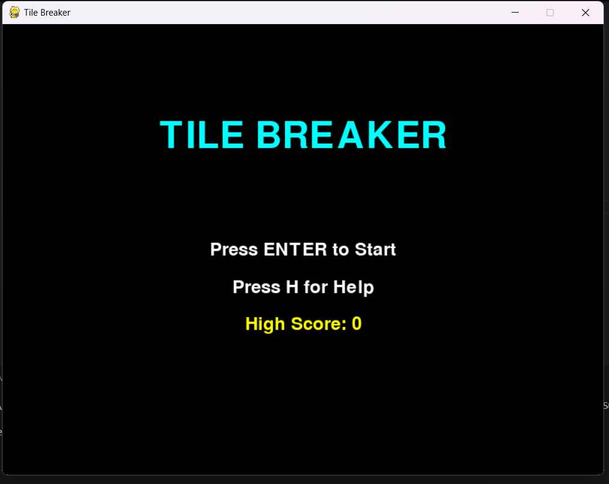
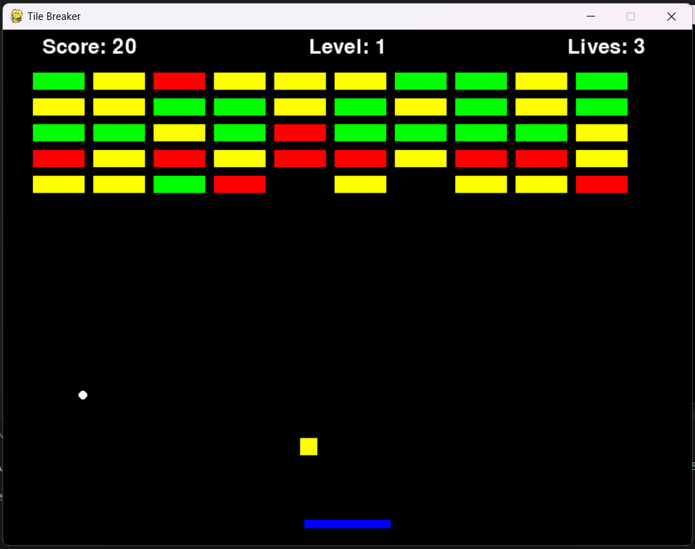
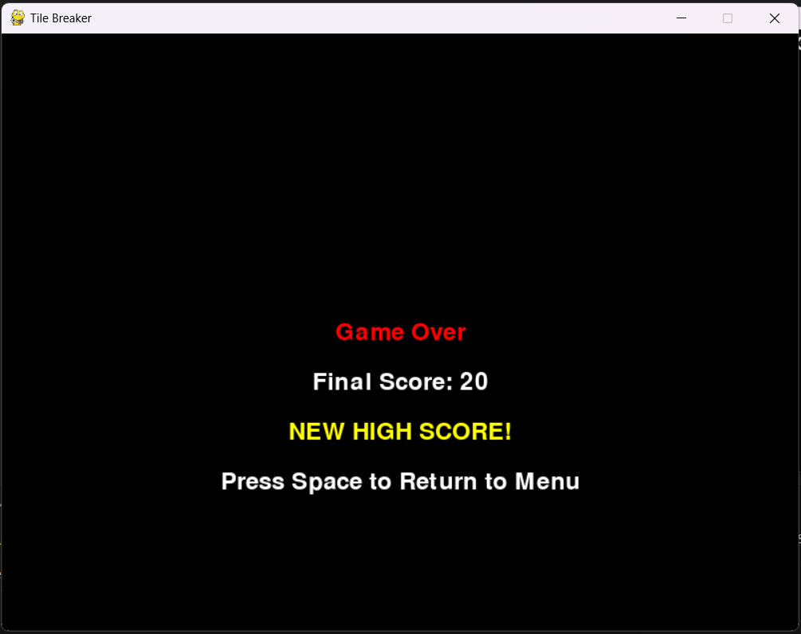

# Tile Breaker Game

Tile Breaker is a classic brick breaker game developed using the Pygame library in Python. Control the paddle to keep the ball in play and break all the tiles to advance through levels. Collect power-ups to enhance your paddle and score points to achieve high scores.

## Features

- **Multiple Levels:** Progress through different levels with increasing difficulty.
- **Power-ups:** Collect power-ups to increase your paddle's width and improve your chances.
- **Scoring System:** Earn points by breaking tiles.
- **Lives System:** Start with 3 lives and try to keep the ball from falling out of bounds.

## Requirements

- Python 3.x
- Pygame library

## Installation

1. **Install Python:**
   - Download and install Python from the official [Python website](https://www.python.org/).

2. **Install Pygame:**
   - Open your terminal or command prompt.
   - Run the following command to install Pygame:
     ```sh
     pip install pygame
     ```

## ScreenShots:





## How to Play

1. **Clone the repository:**
   ```sh
   git clone https://github.com/itsrealsumit007/Tile_Breaker.git
   ```
2. **Navigate to the project directory:**
   ```sh
   cd Tile_Breaker
   ```
3. **Run the game:**
   ```sh
   python main.py
   ```

4. **Game Controls:**
   - **Left Arrow Key:** Move the paddle to the left.
   - **Right Arrow Key:** Move the paddle to the right.

## Game Rules

- **Objective:** Break all the tiles on the screen to advance to the next level.
- **Scoring:** Each tile broken adds 10 points to your score.
- **Lives:** You start with 3 lives. If the ball falls out of bounds, you lose a life. The game ends when you lose all your lives.
- **Power-ups:** Occasionally, power-ups will drop from broken tiles. Collect them with your paddle to increase its width.

## Code Structure

- **tile_breaker.py:** Main game script containing all game logic, including paddle, ball, tiles, and power-ups management.

## AI Usage

- **Bug Fixing:** AI was used to help identify and fix a bug where power-ups were not being drawn correctly on the screen. This bug could have been difficult to diagnose without AI assistance.
- **README Creation:** AI was also used to help create this README file, ensuring all necessary information is included and well-organized.

## Contributing

Contributions are welcome! If you'd like to improve the game or fix any issues, please follow these steps:


## Acknowledgements

- Thanks to the Pygame community for their excellent documentation and resources.

Enjoy playing Tile Breaker! If you have any questions or suggestions, feel free to open an issue or contact me.
